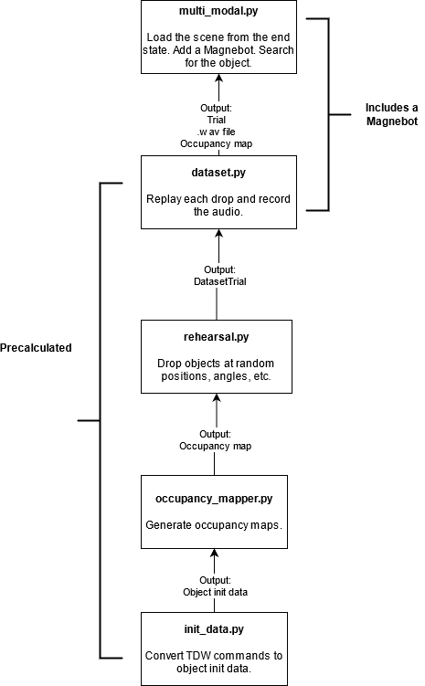

# TDW Multi-Modal Challenge

# Setup

1. `git clone https://github.com/alters-mit/multimodal_challenge.git`
2. `cd path/to/multimodal_challenge` (replace `path/to` with the actual path)
3. `pip3 install -e .`
4. `python3 config.py` You'll be prompted to set directories for the asset bundles (optional) and dataset (mandatory). This will generate a `config.ini` file.

# Audio Dataset Generation

## `init_data.py`

This is a backend tool for TDW  developers to convert saved [TDW commands](https://github.com/threedworld-mit/tdw/blob/master/Documentation/api/command_api.md) into [initialization instructions](doc/api/multimodal_object_init_data.md) and [metadata records](https://github.com/threedworld-mit/tdw/blob/master/Documentation/python/librarian/librarian.md).

[Further documentation here.](doc/dataset/init_data.md)

## `rehearsal.py`

Define [`Drop`](doc/api/drop.md) initialization parameters for target objects. Drop the object. If it lands in a [`DropZone`](doc/api/drop_zone.md), record the `Drop`. This will give `dataset.py` initialization parameters.

[Further documentation here.](doc/dataset/rehearsal.md)

## `dataset.py`

Use the initialization data generated by `rehearsal.py` to create [`Trials`](doc/api/trial.md). A `Trial` is initialization data for each object in the scene (position, rotation, etc.), initialization data for the Magenbot, and a .wav file.

[Further documentation here.](doc/dataset/rehearsal.md)